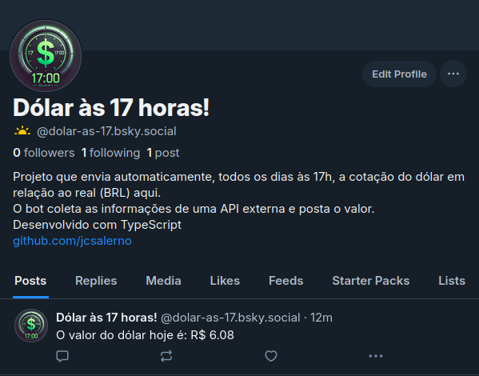

# Dólar às 17 horas - Bot de Cotação de Dólar no BlueSky

Este projeto é um bot que publica diariamente a cotação do dólar no BlueSky. 
O valor do dólar é obtido através de uma API externa e a postagem é feita no BlueSky às 17h, todos os dias.

## Funcionalidades

- Obtenção da cotação do dólar em tempo real utilizando uma API externa.
- Publicação do valor do dólar no BlueSky.
- Agendamento para rodar automaticamente todos os dias às 17h (utilizando um cron job).

 ## Link da Rede Social
 
 - https://bsky.app/profile/dolar-as-17.bsky.social
 
 
